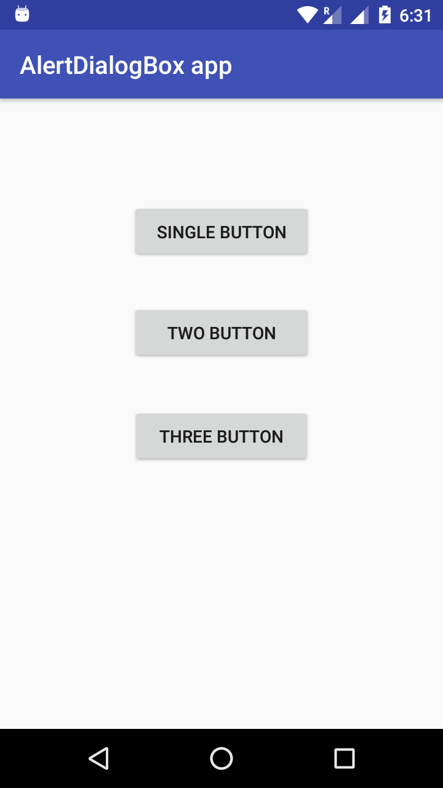
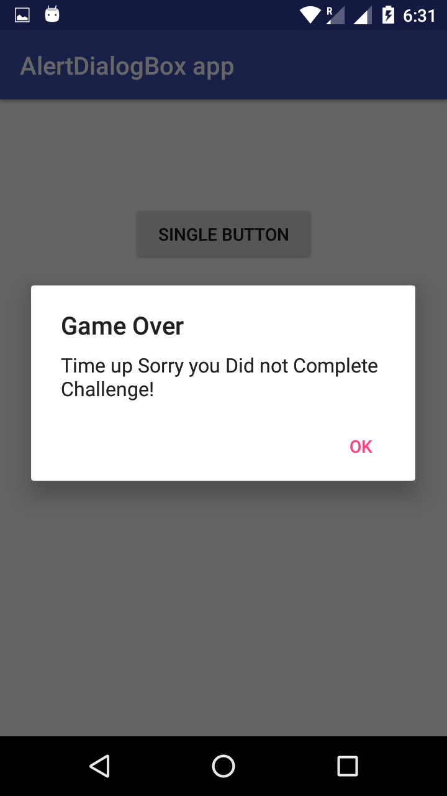
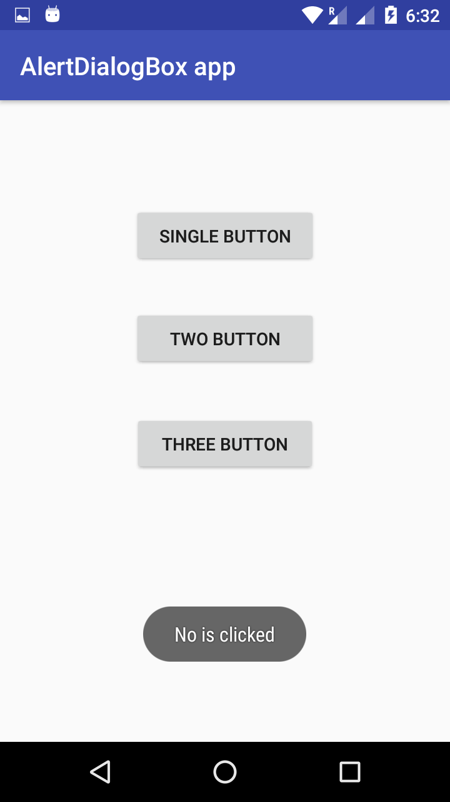
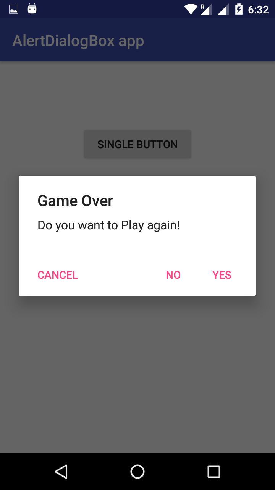
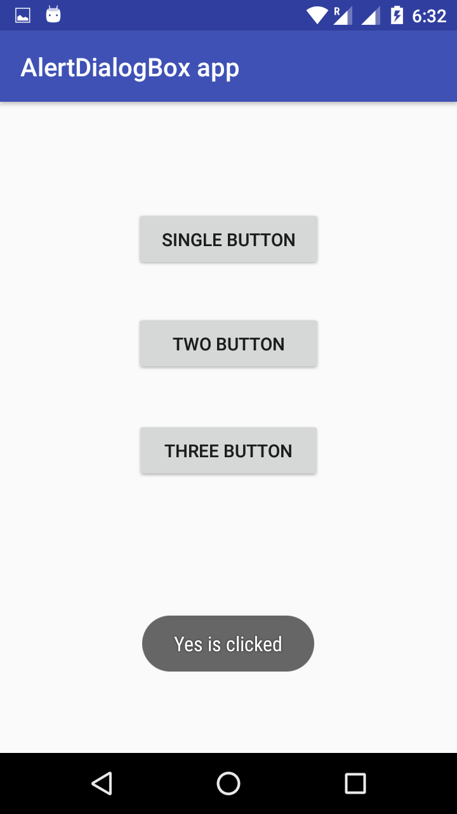

# Simple AlertDialogBox Example app

This app show's that how to use AlertDialogBox to display AlertDialog in Android and how much button we can add in AlertDialogBox and 
what we can do by clicking the button on AlertDialogBox.

## Screenshots:-

  

  
